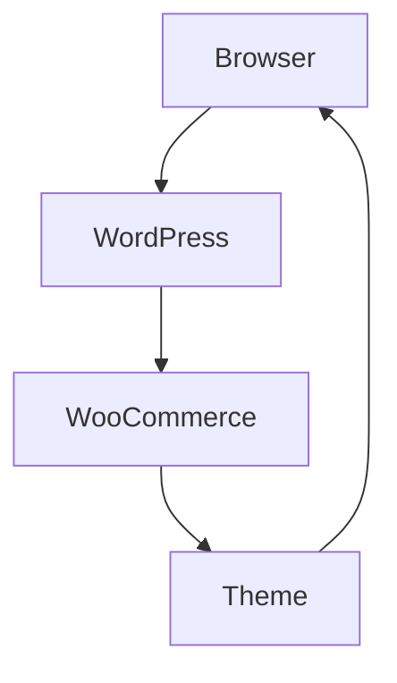
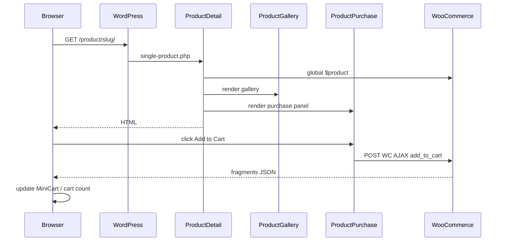
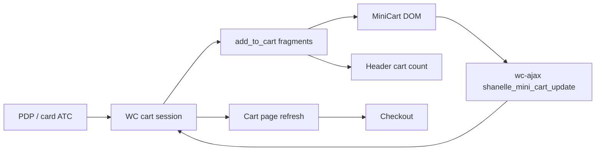

# Data Flow

End-to-end flows for how store data moves from WooCommerce through the Shanelle theme into the browser.

---

## Conceptual chain

```text
Product (WC)
  ↓
WooCommerce APIs / queries
  ↓
Theme templates & composers
  ↓
Component markup + localized JS
  ↓
Browser (render + ES modules + AJAX/REST)
```



---

## Request flow (typical page)

1. HTTP request hits WordPress permalink / WC page endpoint.  
2. WP loads query (`WP_Query` / product query).  
3. Template hierarchy selects theme file (e.g. `single-product.php`).  
4. Template calls composer (`ProductDetail::render()`).  
5. Composer may strip conflicting WC hooks, enqueue assets, require markup.  
6. Markup reads `WC_Product` / cart / taxonomies.  
7. `wp_footer` prints MiniCart + SearchOverlay.  
8. Browser downloads CSS/JS modules and hydrates `[data-shanelle-*]` roots.

---

## Rendering flow (PDP example)



---

## Product listing flow

1. Main query or composer-built `WP_Query` args.  
2. Optional `CatalogFilters::apply_to_product_query` mutates tax/meta/price query.  
3. `ProductGrid::render()` loops posts → `wc_get_product` → `ProductCard::render()`.  
4. Optional load-more via `admin-ajax.php?action=shanelle_load_product_grid` or REST `shanelle/v1/product-grid`.

---

## Cart flow



| Step | Mechanism |
|------|-----------|
| Add | WC `add_to_cart` AJAX (ProductPurchase / ProductCard) or form POST |
| Fragment refresh | `woocommerce_add_to_cart_fragments` |
| Qty change in drawer | `/?wc-ajax=shanelle_mini_cart_update` |
| Full cart page | CartPage + `shanelle_cart_page_get` |
| Persist | WooCommerce session / cookies |

---

## Checkout flow

1. User opens WC checkout page → `form-checkout.php` → `CheckoutPage::render_form()`.  
2. Billing/shipping fields render via WC checkout fields.  
3. Order review HTML supplied by theme on `woocommerce_checkout_order_review`.  
4. Payment methods from registered WC gateways.  
5. `updated_checkout` AJAX refreshes fragments (`CheckoutPage::add_checkout_fragments`).  
6. Place order posts to WC checkout processor → order created.  
7. Redirect to order-received (WC thank-you — not a custom Shanelle composer in this audit).

**Not implemented yet:** Custom multi-step checkout; gateway-specific theme code.

---

## Search flow

| Mode | Path |
|------|------|
| Overlay typing | JS → `admin-ajax` `shanelle_search_suggest` or REST `/wp-json/shanelle/v1/search` |
| Response | JSON with HTML from `SearchResults` + structured matches |
| Full page | WP search → `search.php` → `SearchPage` restricted to products |

---

## Collection flow

1. Terms in taxonomy `product_collection` with private term meta.  
2. Index via CollectionsPage; archive via CollectionPage / taxonomy templates.  
3. Products assigned in admin like categories.  
4. Homepage featured collections read via `Shanelle\Catalog\Queries`.

---

## Price / variation flow

1. `ProductPrice::get_display_data( $product )` normalizes HTML.  
2. Variable selection updates client state via variation JSON + CustomEvents (`shanelle:product-variations:*`).  
3. Purchase panel listens and enables/disables ATC.

---

## Related docs

- [WOOCOMMERCE_ARCHITECTURE.md](./WOOCOMMERCE_ARCHITECTURE.md)  
- [ROUTES.md](./ROUTES.md)  
- [EVENTS.md](./EVENTS.md)  
