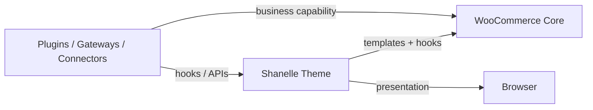
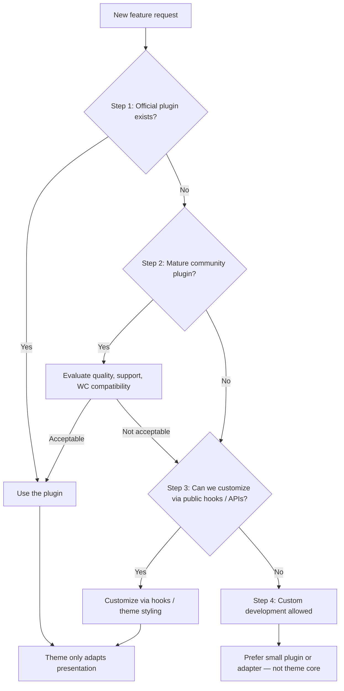

# Plugin First Architecture

**Status:** Official engineering guideline  
**Project:** Shanelle Store  
**Audience:** Engineers, technical leads, and vendors working on theme or integration work  
**Related:** [PROJECT_ARCHITECTURE.md](./PROJECT_ARCHITECTURE.md), [FUTURE_INTEGRATIONS.md](./FUTURE_INTEGRATIONS.md), [PLUGIN_DEPENDENCIES.md](./PLUGIN_DEPENDENCIES.md)

---

## 1. Purpose

Shanelle Store prefers **mature WordPress and WooCommerce plugins** over building equivalent business functionality inside the custom theme.

Custom development is expensive to maintain and easy to break on WordPress and WooCommerce upgrades. Stable plugins are maintained by vendors and communities, audited more often, and replaced with less theme churn.

### Goals of this policy

| Goal | Why it matters |
|------|----------------|
| **Maintainability** | Business logic lives in focused plugins, not sprawling theme classes |
| **Security** | Payment, auth, and security features stay in dedicated, updated packages |
| **Scalability** | Integrations (ads, shops, logistics) can grow without rewriting UI |
| **Upgrade compatibility** | Theme hook removals stay thin; plugins absorb API churn where possible |
| **Lower maintenance cost** | Less custom code to own, test, and document over years |

This document defines when to use plugins, what the theme owns, and how future integrations must be shaped.

---

## 2. Core Philosophy



### The custom theme exists only for

- **UI** — markup structure and visual composition  
- **UX** — interaction patterns, microcopy presentation, client hydration  
- **Presentation** — how WooCommerce data is shown  
- **Design system** — tokens, typography, components, motion  
- **WooCommerce presentation** — template overrides, composers, styled checkout/cart/account shells  

### The theme must never

- Duplicate functionality already provided by stable plugins  
- Embed payment SDKs, pixel SDKs, or logistics APIs in view templates  
- Fork plugin source  
- Become an unofficial plugin framework  

**Rule of thumb:** If a capability is *business logic*, it belongs in a plugin (or a thin adapter plugin). If it is *how that capability looks*, it belongs in the theme.

---

## 3. Plugin First Decision Tree

Every new feature **must** follow this process before custom code is approved.



### Step 1 — Does an official plugin already exist?

**If YES → use it.**  
Examples: WooCommerce core extensions, Meta for WooCommerce, Google Site Kit, official Stripe/PayPal for WooCommerce when they meet requirements.

### Step 2 — Is there a mature community plugin?

**If YES → evaluate it.**  

Evaluate at minimum:

| Criterion | Expectation |
|-----------|-------------|
| Maintenance | Recent updates aligned with current WP/WC |
| Install base / reputation | Proven in production stores |
| Security history | No unresolved critical vulnerabilities |
| License & cost | Compatible with Hostinger deployment |
| Hooks / extensibility | Public filters/actions or documented APIs |
| Conflict risk | Compatible with Shanelle’s custom checkout/cart templates |

**If NO → continue.**

### Step 3 — Can the plugin be customized through hooks?

**If YES → customize.**  

Allowed customization:

- CSS / theme template wrapping for visual fit  
- WordPress / WooCommerce / plugin **public** hooks  
- Small bridging code in a dedicated adapter (preferred) or carefully scoped theme glue that **fails gracefully** if the plugin is inactive  

**If NO → continue.**

### Step 4 — Only now is custom development allowed

Custom code is a last resort. When required:

1. Prefer a **dedicated plugin** (`shanelle-*-integration`) over stuffing logic into `functions.php` or page composers.  
2. Keep the theme limited to presentation hooks.  
3. Document the module in `/docs` and register filters in [CUSTOM_HOOKS.md](./CUSTOM_HOOKS.md) / [FUTURE_INTEGRATIONS.md](./FUTURE_INTEGRATIONS.md).  

---

## 4. Preferred Plugins

The following are **preferred candidates**. Presence in this list does not mean the plugin is already installed. Current installs are listed in [PLUGIN_DEPENDENCIES.md](./PLUGIN_DEPENDENCIES.md).

### SEO

| Preference | Notes |
|------------|--------|
| **Rank Math SEO** | Current stack preference; already used in local project |

### Analytics

| Preference | Notes |
|------------|--------|
| **Google Site Kit** | GA4 / Search Console when appropriate |
| **Meta Pixel** | Via Meta’s WooCommerce / official tagging solutions or adapter + Site Kit/GTM |
| **TikTok Pixel** | Via TikTok’s official WooCommerce tools or Events API adapter |

Prefer a single tag manager / event mapper over multiple hard-coded scripts inside theme JS.

### Instagram / Meta social commerce

| Preference | Notes |
|------------|--------|
| **Meta for WooCommerce** (or current official Meta Commerce connector) | Catalog sync and shopping surfaces |

### TikTok

| Preference | Notes |
|------------|--------|
| **TikTok for WooCommerce** (or current official TikTok Shop connector) | Catalog / shop sync |

### Payments

| Preference | Notes |
|------------|--------|
| **Stripe** | Official WooCommerce Stripe gateway preferred |
| **PayPal** | WooCommerce PayPal Payments (or current official plugin) |
| **PixelPay** | Certified WC gateway plugin if available; otherwise custom *gateway plugin*, never theme |
| **BAC Credomatic** | Same rule as PixelPay |

### Shipping

| Preference | Notes |
|------------|--------|
| **WooCommerce Shipping** / core shipping framework | Baseline zones and methods |
| **Cargo Mobil plugin** | Use if a maintained plugin exists; else custom `WC_Shipping_Method` **plugin** |

### Caching

| Preference | Notes |
|------------|--------|
| **LiteSpeed Cache** | When Hostinger/LiteSpeed stack supports it |
| **Hostinger Cache** | Host-native caching with WooCommerce exclusions |

### Security

| Preference | Notes |
|------------|--------|
| **Wordfence** | WAF / malware / login security |
| **Solid Security** | Alternative hardening suite |

Choose one primary security suite to avoid overlap.

### Forms

| Preference | Notes |
|------------|--------|
| **Fluent Forms** | Preferred lightweight option when evaluating |
| **Gravity Forms** | When advanced workflows needed |
| **WPForms** | Acceptable mature alternative |

Theme should style forms, not reimplement form engines.

### Media

| Preference | Notes |
|------------|--------|
| **Imagify** | Compression / WebP |
| **ShortPixel** | Alternative optimizer |
| **Smush** | Alternative optimizer |

Pick one image optimization plugin.

### PWA

| Preference | Notes |
|------------|--------|
| **Official / mature PWA plugin** | Only if it respects WooCommerce cart/checkout cache exclusions |

If unsuitable, a dedicated PWA plugin owned by Shanelle is still preferred over baking a service worker into the theme.

---

## 5. Custom Development Policy

Custom development is allowed **only** when one or more of these are true:

| Condition | Example |
|-----------|---------|
| **No plugin exists** | Proprietary Cargo Mobil API with no WC plugin |
| **Plugin cannot satisfy requirements** | Checkout UX requirement blocked by closed plugin with no hooks |
| **Business requires custom logic** | Shanelle-specific collection scoring already in theme catalog domain |
| **Performance requires replacement** | Abandoned query-heavy plugin that cannot be configured down |
| **Plugin is abandoned** | No updates for current WP/WC; security risk |

Even then:

- Implement as a **plugin or adapter**, not as a permanent expansion of PDP/cart composers.  
- Expose configuration and fail safely when disabled.  
- Revisit the decision tree when a mature plugin appears later.

---

## 6. Theme Responsibilities

The `shanelle` theme **owns**:

| Responsibility | Examples in this project |
|----------------|--------------------------|
| **Rendering** | Component markup under `components/` |
| **Components** | ProductCard, MiniCart, ProductGallery, … |
| **Layouts** | Homepage, shop archive, PDP, cart, checkout, account shells |
| **Animations** | Design-system motion, gallery crossfade, UI transitions |
| **WooCommerce templates** | Overrides under `woocommerce/` |
| **Customizer** | Homepage, cart, checkout, search, footer settings |
| **Design tokens** | `assets/css/base/variables.css` |
| **Theme styling** | Global + per-component CSS |

The theme may:

- Remove/replace **presentation** hooks (e.g. default single-product summary markup)  
- Listen to public events for UI refresh (`shanelle:*`, WC fragments)  
- Provide **empty presentation hooks / filters** so plugins can inject content  

The theme may **not** own the long-term home for payments, pixels, logistics APIs, or OAuth.

---

## 7. Plugin Responsibilities

Plugins (core WC extensions or third-party) **own**:

| Domain | Examples |
|--------|----------|
| **SEO** | Titles, sitemaps, schema |
| **Payments** | Gateways, webhooks, SCA/3DS |
| **Shipping** | Rates, labels, tracking numbers |
| **Analytics** | Pixels, GA4, CAPI/Events API |
| **Social commerce** | Instagram / TikTok catalog sync |
| **Security** | Firewall, bot protection, hardening |
| **Caching** | Full-page / object cache (WC-aware) |
| **Forms** | Lead and contact forms |
| **Authentication** | Social login, SSO |

WooCommerce itself remains the commerce kernel: products, cart session, orders, customers.

---

## 8. Compatibility Rules

### Never edit plugin files

Edits under `wp-content/plugins/{vendor}/` are forbidden. They are lost on update and break support.

### Never depend on plugin internals

Do not call private classes, undocumented files, or copy-pasted plugin PHP into the theme.

### Use public APIs

- WordPress Plugin API  
- WooCommerce CRUD / session / checkout APIs  
- Documented REST endpoints  
- Documented plugin hooks  

### Use WordPress hooks

`add_action` / `add_filter` on documented tags only.

### Use WooCommerce hooks

Payment boxes, shipping methods, order status, thank-you, cart fragments — extend via WC hooks, not theme forks of gateway markup unless the gateway documents it.

### Fail gracefully when plugins are disabled

Theme code that *optionally* enhances a plugin must:

1. Check for class/function existence or `is_plugin_active` equivalents appropriately.  
2. Degrade to a working storefront (or hide the UI slice) without fatals.  
3. Avoid hard `require` of plugin files from the theme.  

Shanelle already practices this pattern for WooCommerce via `shanelle_is_woocommerce_active()` — extend the same idea to future integrations.

---

## 9. Future Integrations

Each planned capability must be implemented as a **plugin or adapter**, not inside the theme’s presentation core. Detailed plans live in [FUTURE_INTEGRATIONS.md](./FUTURE_INTEGRATIONS.md); this section is the architecture binding.

| Integration | Plugin-first approach | Theme role |
|-------------|----------------------|------------|
| **Instagram** | Meta for WooCommerce / official catalog connector | Style product URLs/images; no feed exporter in composers |
| **TikTok** | TikTok for WooCommerce / official shop connector | Same as Instagram |
| **Cargo Mobil** | Shipping method plugin (`WC_Shipping_Method`) or vendor plugin | Style rates UI; optional estimate filters already exist |
| **Stripe** | Official WooCommerce Stripe plugin | Checkout template already exposes WC payment hooks |
| **PayPal** | Official WooCommerce PayPal plugin | Same; watch express-button placement |
| **PixelPay** | WC payment gateway plugin | Payment box styling only |
| **BAC Credomatic** | WC payment gateway plugin | Payment box styling only |
| **Social login** | Mature social login / OAuth plugin | Style My Account buttons |
| **PWA** | Mature PWA plugin or Shanelle PWA plugin | Theme supplies UI; SW/caching rules outside theme views |
| **Native apps** | Separate app + WC REST / BFF | Theme remains the web channel only |

### Adapter pattern (when glue is required)

```text
[Third-party plugin]
        ↓ public hooks / REST
[shanelle-{vendor}-adapter plugin]  ← thin, ownable, optional
        ↓ shanelle_* filters / DOM events
[shanelle theme presentation]
```

Adapters may:

- Map pixel events from `shanelle:added_to_cart` and WC thank-you  
- Fill `shanelle_product_shipping_estimate` from a rates service  
- Register gateways  

Adapters must not:

- Re-implement MiniCart / CheckoutPage  
- Store API secrets inside theme Customizer free-text fields without care  

---

## 10. Conclusion

The Shanelle theme should remain **lightweight**.

- **Business functionality belongs to plugins.**  
- **The theme enhances plugins** with fashion-forward UI, UX, and WooCommerce presentation.  
- **The theme never replaces plugins** for SEO, payments, shipping, analytics, security, caching, forms, or authentication.

When choosing between “build it in the theme” and “install or write a plugin,” choose the plugin path first. Custom theme code is for how Shanelle *looks and feels* — not for becoming a second WooCommerce.

---

## Enforcement checklist (PR / feature review)

Before merging a feature:

- [ ] Decision tree steps documented in the PR description  
- [ ] No new plugin file edits  
- [ ] No secrets in the theme  
- [ ] Optional integrations fail gracefully  
- [ ] Theme changes limited to presentation unless justified under §5  
- [ ] Docs updated (`PLUGIN_DEPENDENCIES`, `FUTURE_INTEGRATIONS`, or this file) when ownership changes  

---

## Document control

| Item | Value |
|------|--------|
| Owner | Shanelle engineering |
| Applies to | Theme + any first-party plugins |
| Last defined | Documentation initiative — Plugin First Architecture |
