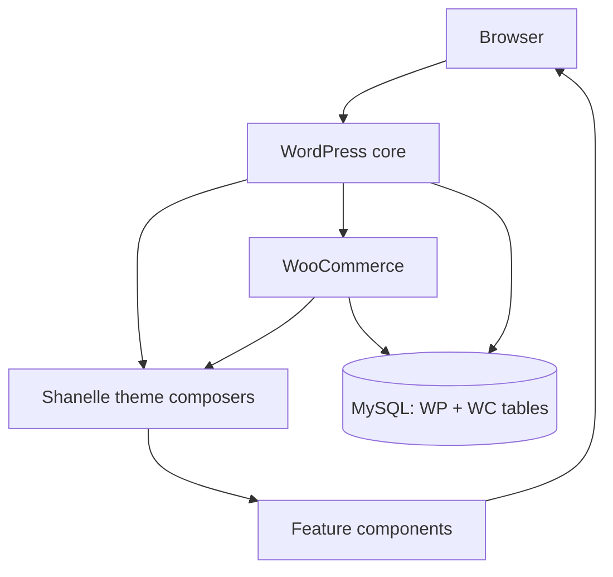

# Project Architecture

**Project:** Shanelle Store  
**Platform:** WordPress + WooCommerce  
**Theme:** `shanelle` (custom)  
**Local environment:** FlyEnv  
**Production target:** Hostinger  
**Status:** UI development (integrations deferred)

---

## Project overview

Shanelle Store is a premium women’s fashion e-commerce site. The custom theme owns storefront UX (Shein-inspired patterns with an independent brand identity) while WooCommerce owns cart, catalog data, checkout processing, orders, and customers.

The theme is **component-orchestrated**: thin WordPress/WooCommerce templates delegate to PHP page composers, which assemble feature components (each with PHP controller, markup, CSS, and optional JS module).

---

## Technology stack

| Layer | Technology | Notes |
|-------|------------|--------|
| CMS | WordPress 6.4+ (theme requires) | Tested up to 6.8 in `style.css` |
| Commerce | WooCommerce | Required |
| Language | PHP 8.3+ | `declare(strict_types=1)` throughout theme |
| Frontend JS | ES modules (`type="module"`) | Per-component scripts |
| CSS | Native design tokens + `@import` | No theme bundler / `package.json` |
| Fonts | Google Fonts (Cormorant Garamond, DM Sans) | Enqueued in `inc/assets.php` |
| Search / SEO plugin | Rank Math | Present under `wp-content/plugins` |
| Fields plugin | Advanced Custom Fields | Installed; theme catalog uses custom term meta, not ACF APIs |
| Dev tools | Query Monitor, Health Check | Local diagnostics |

**Not implemented yet:** Composer autoload for the theme, Node build pipeline, PWA service worker, payment/shipping/social plugins beyond WC core.

---

## Folder structure (application-relevant)

```
wordpress/
├── wp-config.php                 Local DB + debug config (secrets; do not commit/share)
├── wp-content/
│   ├── themes/shanelle/          Custom theme (primary application code)
│   ├── plugins/                  WooCommerce + utilities
│   └── mu-plugins/               Empty / not used
└── docs/                         Technical documentation (this folder)
```

Theme root (abbreviated):

```
wp-content/themes/shanelle/
├── functions.php
├── style.css
├── header.php, footer.php, front-page.php, …
├── assets/{css,js,images}
├── components/{feature}/         Views + CSS/JS
├── inc/{setup,assets,components,woocommerce,catalog}
├── template-parts/components/    Shared partials (e.g. site-header)
├── woocommerce/                  Template overrides
└── page-templates/
```

---

## Application layers



1. **Request / routing** — WordPress rewrite + WooCommerce page endpoints  
2. **Template shell** — `header.php` / WC override / `front-page.php`  
3. **Composer** — `Homepage`, `ProductDetail`, `CartPage`, etc.  
4. **Components** — gallery, purchase, grid, mini-cart, …  
5. **Domain APIs** — `WC_Product`, cart session, taxonomies  
6. **Client hydration** — ES modules + `shanelle:*` CustomEvents  

---

## Theme architecture (summary)

- **Bootstrap:** `functions.php` defines `SHANELLE_*` constants, requires includes, calls `::boot()` on each component class.  
- **Helpers:** `inc/components.php` exposes `shanelle_*()` render functions.  
- **Dual UI homes:** modern `components/` + legacy `template-parts/components/` (header still uses template-parts).  
- **Design system:** `assets/css/main.css` imports tokens, utilities, shared UI.  

See [THEME_ARCHITECTURE.md](./THEME_ARCHITECTURE.md).

---

## WooCommerce architecture (summary)

- Theme **removes** default loop/single summary hooks and replaces layouts with composers.  
- Checkout/cart still use WooCommerce processors and sessions.  
- Custom taxonomy: `product_collection` (rewrite slug `collection`).  
- Expected product attributes: `pa_size`, `pa_color`, `pa_material`, and others used by filters/related scoring.  

See [WOOCOMMERCE_ARCHITECTURE.md](./WOOCOMMERCE_ARCHITECTURE.md).

---

## High-level system design

| Concern | Owner |
|---------|--------|
| Catalog content | WooCommerce products + attributes + `product_collection` |
| Listing / PDP UX | Shanelle components |
| Cart session | WooCommerce |
| Mini cart / bag UX | `MiniCart` + fragments / WC AJAX |
| Checkout fields & payment | WooCommerce (+ future gateway plugins) |
| Account / orders | WooCommerce endpoints + `MyAccountPage` theming |
| Live search | `SearchController` (admin-ajax + REST) |
| Extensibility | `shanelle_*` filters/actions + DOM events |

---

## Current development status

| Area | Status |
|------|--------|
| Design system / branding tokens | In place |
| Homepage composition | Implemented (category icons, featured collections, For You grid) |
| Shop archive + filters | Implemented |
| Collections taxonomy + pages | Implemented |
| Product detail (gallery, purchase, info, related) | Largely implemented |
| Cart / checkout / my account theming | Implemented |
| Mini cart / search overlay | Implemented |
| Analytics / pixels | Not implemented yet |
| Payment gateways (Stripe, PixelPay, etc.) | Not implemented yet |
| Cargo Mobil logistics | Not implemented yet |
| Social commerce / social login | Not implemented yet |
| PWA / native apps | Not implemented yet (REST stubs exist) |

See [PROJECT_STATUS.md](./PROJECT_STATUS.md).

---

## Planned roadmap (product intent)

1. Finalize UI on FlyEnv  
2. Deploy theme to Hostinger  
3. Add payments + shipping integrations as **plugins / thin modules** (not theme rewrites)  
4. Add analytics pixels listening to WC + `shanelle:*` events  
5. Social login + social shop feeds  
6. PWA, then mobile apps consuming WC/Store API or `shanelle/v1`  

See [FUTURE_INTEGRATIONS.md](./FUTURE_INTEGRATIONS.md).

---

## Future scalability

**Strengths for scale**

- Page composers and filters isolate future integrations.  
- REST namespace `shanelle/v1` for search/grid.  
- Shared cart state between MiniCart, Cart, Checkout.  
- Event catalog for analytics bridges (`docs/EVENTS.md`).  

**Constraints**

- No theme autoloader / CI in repo.  
- CSS `@import` without bundling.  
- Heavy listing queries possible (For You limit, related candidate pool).  
- Integrations must stay out of view templates to avoid refactor cost.  

---

## Related documents

- [THEME_ARCHITECTURE.md](./THEME_ARCHITECTURE.md)  
- [WOOCOMMERCE_ARCHITECTURE.md](./WOOCOMMERCE_ARCHITECTURE.md)  
- [DATA_FLOW.md](./DATA_FLOW.md)  
- [ROUTES.md](./ROUTES.md)  
- [FUTURE_INTEGRATIONS.md](./FUTURE_INTEGRATIONS.md)  
