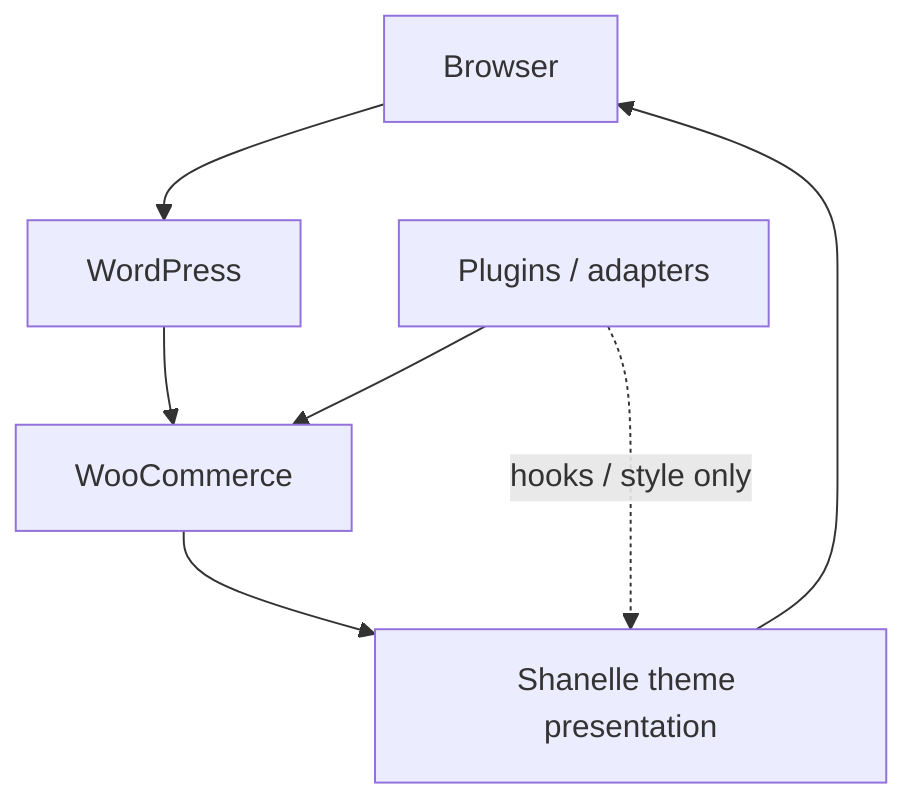

# Shanelle Store — Documentation Entry Point

**This folder is the source of truth for project architecture.**  
Before making architectural, integration, or plugin decisions, read the relevant documents here.  
`.cursorrules` encodes policy; `/docs` explains how the system actually works.

---

## Project overview

| Item | Value |
|------|--------|
| **Project** | Shanelle Store |
| **Product** | Premium women's fashion e-commerce |
| **Stack** | WordPress + WooCommerce + custom theme `shanelle` |
| **Theme path** | `wp-content/themes/shanelle/` |
| **PHP** | 8.3+ |
| **Local** | FlyEnv |
| **Production** | Hostinger |
| **Current phase** | UI development; third-party integrations deferred |
| **Storefront language** | Latin American Spanish only (theme UI). Set WP site language to Español for WooCommerce/WordPress core strings. |

The theme owns **UI, UX, design system, and WooCommerce presentation**.  
Business capabilities (payments, pixels, logistics, SEO engines, social commerce) belong to **plugins** or thin adapters — see [PLUGIN_FIRST_ARCHITECTURE.md](./PLUGIN_FIRST_ARCHITECTURE.md).

Where something does not exist yet, core docs say **Not implemented yet.**

---

## Reading order

### For a new engineer or AI session (minimum viable context)

| Step | Document | Why |
|------|----------|-----|
| 1 | [PROJECT_ARCHITECTURE.md](./PROJECT_ARCHITECTURE.md) | Stack, layers, status |
| 2 | [PLUGIN_FIRST_ARCHITECTURE.md](./PLUGIN_FIRST_ARCHITECTURE.md) | What theme vs plugins may own |
| 3 | [THEME_ARCHITECTURE.md](./THEME_ARCHITECTURE.md) | Templates, components, assets |
| 4 | [WOOCOMMERCE_ARCHITECTURE.md](./WOOCOMMERCE_ARCHITECTURE.md) | Shop → PDP → cart → checkout → account |
| 5 | [DATA_FLOW.md](./DATA_FLOW.md) | Request / cart / checkout flows |
| 6 | [PROJECT_STATUS.md](./PROJECT_STATUS.md) | What is done vs not started |
| 7 | [TECH_DEBT.md](./TECH_DEBT.md) | Known pitfalls before changing code |

### Before implementing a feature

| If the work is… | Read |
|-----------------|------|
| UI / layout / components | Theme Architecture → UI Components → relevant `pages/` or `components/` doc |
| Checkout / cart / payments styling | WooCommerce Architecture → FUTURE_INTEGRATIONS → Plugin First |
| SEO / analytics / pixels / feeds | Plugin First → Plugin Dependencies → Future Integrations |
| Shipping / Cargo Mobil | Future Integrations → Plugin First → Custom Hooks (estimate filters) |
| Performance | Performance → Deployment |
| Security-sensitive change | Security → Routes |
| Hostinger / migrate | Deployment → Project Status |

### Before writing custom business logic

1. [PLUGIN_FIRST_ARCHITECTURE.md](./PLUGIN_FIRST_ARCHITECTURE.md) — decision tree  
2. [PLUGIN_DEPENDENCIES.md](./PLUGIN_DEPENDENCIES.md) — what is already installed  
3. [FUTURE_INTEGRATIONS.md](./FUTURE_INTEGRATIONS.md) — planned approach  
4. Justify plugin insufficiency (required by `.cursorrules` Code Review Rule)

---

## Documentation map

### Core architecture (required reading)

| Document | Exists | Description |
|----------|--------|-------------|
| [PROJECT_ARCHITECTURE.md](./PROJECT_ARCHITECTURE.md) | Yes | Overview, stack, layers, roadmap, scalability |
| [PLUGIN_FIRST_ARCHITECTURE.md](./PLUGIN_FIRST_ARCHITECTURE.md) | Yes | Official plugin-first engineering guideline |
| [THEME_ARCHITECTURE.md](./THEME_ARCHITECTURE.md) | Yes | Template hierarchy, assets, PHP/JS/CSS |
| [WOOCOMMERCE_ARCHITECTURE.md](./WOOCOMMERCE_ARCHITECTURE.md) | Yes | Commerce surfaces, overrides, attributes |
| [DATA_FLOW.md](./DATA_FLOW.md) | Yes | Product → WC → theme → browser |
| [PLUGIN_DEPENDENCIES.md](./PLUGIN_DEPENDENCIES.md) | Yes | Installed plugins and coupling |
| [SECURITY.md](./SECURITY.md) | Yes | Escaping, nonces, risks |
| [PERFORMANCE.md](./PERFORMANCE.md) | Yes | Assets, queries, caching |
| [FUTURE_INTEGRATIONS.md](./FUTURE_INTEGRATIONS.md) | Yes | Payments, pixels, logistics, PWA, apps (plans) |
| [DEPLOYMENT.md](./DEPLOYMENT.md) | Yes | FlyEnv → Hostinger |
| [PROJECT_STATUS.md](./PROJECT_STATUS.md) | Yes | Completed / in progress / not started |
| [TECH_DEBT.md](./TECH_DEBT.md) | Yes | Debt and maintainability risks |

### Supporting core docs

| Document | Description |
|----------|-------------|
| [UI_COMPONENTS.md](./UI_COMPONENTS.md) | Full component inventory |
| [CUSTOM_HOOKS.md](./CUSTOM_HOOKS.md) | Theme `shanelle_*` actions & filters |
| [ROUTES.md](./ROUTES.md) | Pages, AJAX, REST, rewrites |
| [DATABASE.md](./DATABASE.md) | WP/WC tables + theme term meta |
| [EVENTS.md](./EVENTS.md) | `shanelle:*` DOM events for UI/analytics bridges |
| [DOCUMENTATION_ROADMAP.md](./DOCUMENTATION_ROADMAP.md) | How to improve this docs system over time |

### Supplementary (deep dives; prefer core docs first)

| Area | Index |
|------|--------|
| Components | [COMPONENTS.md](./COMPONENTS.md) → `docs/components/*` |
| Pages | `docs/pages/*` (HOMEPAGE may lag live markup — verify code) |
| Design collaboration | [design-system/UI-RULES.md](./design-system/UI-RULES.md) |
| Legacy sketch | [ARCHITECTURE.md](./ARCHITECTURE.md) — superseded by PROJECT_ARCHITECTURE |

### Codebase anchors

| What | Path |
|------|------|
| Theme | `wp-content/themes/shanelle/` |
| Theme controllers | `wp-content/themes/shanelle/inc/components/` |
| Catalog module | `wp-content/themes/shanelle/inc/catalog/` |
| Future integrations (policy target) | `wp-content/themes/shanelle/inc/integrations/` (**Not implemented yet** as a populated tree) |
| Plugins | `wp-content/plugins/` |
| Agent rules | `.cursorrules` (repo root) |

---

## Architecture philosophy

- **Component-orchestrated theme:** thin WP/WC templates → page composers → feature components (PHP + markup + CSS + JS).  
- **Architecture is complete for presentation:** do not redesign the composer/component model; extend it.  
- **Reuse over rewrite:** ProductCard, ProductGrid, MiniCart state, design tokens, etc.  
- **Documented reality over aspiration:** core docs describe the codebase; mark gaps explicitly.  
- Details: [PROJECT_ARCHITECTURE.md](./PROJECT_ARCHITECTURE.md), [THEME_ARCHITECTURE.md](./THEME_ARCHITECTURE.md).

---

## Plugin First philosophy

- Prefer mature WordPress/WooCommerce plugins over custom business code.  
- Theme = presentation; plugins = SEO, payments, shipping, analytics, auth, caching, security, feeds, pixels.  
- Decision tree: official plugin → community plugin → hooks → custom (last).  
- Custom integrations must be isolated (prefer `inc/integrations/{vendor}/` or a dedicated plugin), never buried in UI components.  
- Details: [PLUGIN_FIRST_ARCHITECTURE.md](./PLUGIN_FIRST_ARCHITECTURE.md), [PLUGIN_DEPENDENCIES.md](./PLUGIN_DEPENDENCIES.md).

---

## WooCommerce philosophy

- WooCommerce is the commerce engine (catalog, cart session, checkout processor, orders, customers).  
- The theme styles and composes WC surfaces; it does not replace WC APIs.  
- Template overrides live under `woocommerce/`; composers strip presentation hooks carefully.  
- Payments and shipping methods are gateways/plugins, not hardcoded theme providers.  
- Details: [WOOCOMMERCE_ARCHITECTURE.md](./WOOCOMMERCE_ARCHITECTURE.md), [DATA_FLOW.md](./DATA_FLOW.md).

---

## Future integration philosophy

- Do not implement Instagram Shop, TikTok Shop, pixels, Cargo Mobil, social login, or PWA inside PDP/cart composers.  
- Plan first (this docs set); implement after UI freeze + Hostinger deploy.  
- Use plugins/adapters + public hooks + `shanelle:*` events / `shanelle_*` filters.  
- Stay ready for PWA, headless, and apps without a theme rewrite.  
- Details: [FUTURE_INTEGRATIONS.md](./FUTURE_INTEGRATIONS.md), [PROJECT_STATUS.md](./PROJECT_STATUS.md).

---

## Deployment philosophy

- Develop on **FlyEnv**; ship to **Hostinger**.  
- Keep deployment portable — avoid host-only APIs in theme code.  
- Never copy local `wp-config.php` secrets to production; never put secrets in docs.  
- Cache must exclude cart/checkout/account.  
- Details: [DEPLOYMENT.md](./DEPLOYMENT.md), [PERFORMANCE.md](./PERFORMANCE.md), [SECURITY.md](./SECURITY.md).

---

## How AI / Cursor should use this folder

1. Open this README.  
2. Open the docs for the domain you will change.  
3. Follow Plugin First before writing business logic.  
4. Prefer extending existing components and hooks.  
5. After architectural changes, update the matching core doc in the same change set.  
6. Treat **Not implemented yet** as a hard stop against inventing phantom APIs.

Conflict rule: if `.cursorrules` and `/docs` ever disagree on *facts about the codebase*, believe the code and fix the docs. If they disagree on *policy*, follow Plugin First + theme presentation boundaries.

---

## Documentation hygiene

- Mark absences as **Not implemented yet.**  
- No secrets in markdown.  
- Prefer links over duplicating long tables across files.  
- Sync `pages/HOMEPAGE.md` when homepage composition changes.  
- Remove or clearly label legacy docs when they drift (see [DOCUMENTATION_ROADMAP.md](./DOCUMENTATION_ROADMAP.md)).
