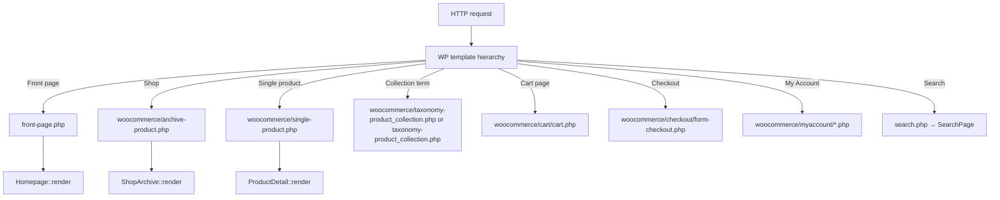

# Theme Architecture

**Theme path:** `wp-content/themes/shanelle/`  
**Text domain:** `shanelle`  
**Version:** `1.0.0` (see `style.css`)

---

## Theme structure

| Path | Role |
|------|------|
| `functions.php` | Constants, requires, `::boot()` calls |
| `style.css` | Theme header metadata only |
| `header.php` / `footer.php` | Document chrome |
| `front-page.php` | Homepage shell → `shanelle_homepage()` |
| `search.php`, `404.php`, `index.php` | Core templates |
| `taxonomy-product_collection.php` | Collection taxonomy archive |
| `page-templates/about.php` | About page template |
| `page-templates/contact.php` | Contact informational page |
| `page-templates/faq.php` | FAQ informational page |
| `page-templates/shipping.php` | Shipping policy page |
| `page-templates/returns.php` | Returns policy page |
| `page-templates/privacy.php` | Privacy policy page |
| `page-templates/terms.php` | Terms & conditions page |
| `page-templates/cookies.php` | Cookie policy page |
| `page-templates/info-content.php` | Generic editorial info (size guide, tracking, payments) |
| `page-templates/collections.php` | Collections index page template |
| `assets/` | Global CSS/JS/images |
| `components/` | Feature views + scoped CSS/JS (includes reusable `page-hero/`) |
| `inc/` | PHP bootstrap, controllers, catalog, WC helpers |
| `template-parts/components/` | Shared / older partials |
| `woocommerce/` | WC template overrides |

---

## Template hierarchy (as used)


```mermaid
flowchart TD
  Req[HTTP request] --> WP[WP template hierarchy]
  WP -->|Front page| FP[front-page.php]
  WP -->|Shop| ARCH[woocommerce/archive-product.php]
  WP -->|Single product| SP[woocommerce/single-product.php]
  WP -->|Collection term| COLL[woocommerce/taxonomy-product_collection.php or taxonomy-product_collection.php]
  WP -->|Cart page| CART[woocommerce/cart/cart.php]
  WP -->|Checkout| CHK[woocommerce/checkout/form-checkout.php]
  WP -->|My Account| ACC[woocommerce/myaccount/*.php]
  WP -->|Search| SR[search.php → SearchPage]
  FP --> HOM[Homepage::render]
  ARCH --> SA[ShopArchive::render]
  SP --> PD[ProductDetail::render]
```

Templates are intentionally thin: they call a composer and exit.

---

## Template parts

Located under `template-parts/components/`:

| File | Purpose |
|------|---------|
| `site-header.php` | Global header (promo bar, logo, search, nav actions) |
| `site-footer.php` | Legacy/simple footer partial (primary footer is `Footer` component) |
| `cart-count.php` | Header cart count fragment |
| `product-card.php` | Legacy wrapper path (live cards use `ProductCard` component) |
| `hero-banner.php` | Legacy/partial hero markup |
| `category-chips.php` | Category chip UI |
| `empty-state.php` | Empty state block |
| `section-heading.php` | Section heading pattern |

Helper: `shanelle_component( $slug )` → `get_template_part( 'template-parts/components/' . $slug )`.

---

## Header

- Rendered from `header.php` via `shanelle_component( 'site-header' )`.  
- Markup: `template-parts/components/site-header.php`.  
- Styles: `assets/css/components/site-header.css` (pulled through `main.css`).  
- Customizer / helpers: `inc/components/SiteHeader.php` (promotion banner: up to 6 slots, optional URLs, marquee speed, contact URL).  
- Behavior: `assets/js/main.js` → `modules/mobile-drawer.js` (drawer hydration via `[data-header]`), `modules/sticky-header-offset.js` (publishes `--site-header-sticky-height`), `modules/auto-hide-header.js` (**disabled** — promo + main header + category nav stay sticky/visible while scrolling), `modules/promo-banner.js` (stadium-style ticker when promos overflow).  
- Layout: promo / main / category navbar inners use `container-fluid` so the header chrome spans the full viewport width on desktop (token padding, no max-width cap).  
- Search: desktop header field focuses `SearchOverlay`; mobile uses search icon + drawer CTA (`data-shanelle-search-open`).  
- Integrates: promotion banner, cart count badge, account link, category navbar via `CategoryNavbar::render()`.  
- Mobile drawer: focus trap + `aria-modal`, nested menu styles, fallback links when no menus assigned; customer-service CTA uses Customizer/WP contact page URL.  
- Storefront copy is Latin American Spanish only (no language switcher in chrome).

**Not implemented yet:** server-side wishlist (card + PDP favourites remain localStorage-only); full migrate of markup into `components/header/` package.

Note: `components/header/` directory exists but is empty (architecture cleanup deferred).

---

## Footer

- `footer.php` calls `shanelle_footer()` → `Footer::render()`.  
- Files: `inc/components/Footer.php`, `components/footer/{footer.php,footer.css,footer.js}`.  
- Layout: CSS Grid — Brand | Useful Links | Customer Service | Engage (compact newsletter + social) on desktop; Contact under Brand. Policies / legal links sit in the bottom bar as a pipe-separated wrapping list under copyright. See [components/Footer.md](./components/Footer.md).  
- Brand column: `inc/components/FooterBrand.php` + `components/footer-brand/` (logo + description; social rendered in engage cluster).  
- Useful Links column: `inc/components/FooterLinks.php` + `components/footer-links/` (`wp_nav_menu`, no hard-coded links).  
- Customer Service column: `inc/components/FooterCustomerService.php` + `components/footer-customer-service/` (reuses FooterLinks visual system).  
- Policies legal links: `inc/components/FooterPolicies.php` + `components/footer-policies/` (bottom bar; pipe-separated wrap).  
- Menu locations **`footer_useful_links`**, **`footer_customer_service`**, **`footer_policies`**. Legacy `footer_shop` / `footer_legal` still resolved by Useful Links / Policies if the new locations are empty.  
- Customizer-driven: logo, brand description, contact (title/phone/email/WhatsApp/address/hours/optional Maps embed), social URLs (empty → `#`), copyright, payment icon slugs, scroll-to-top toggle, optional contact/WhatsApp FAB.  
- Newsletter block is optional (**off by default**). Theme renders Customizer title/description plus **Newsletter Embed Code** (provider HTML/JS embed such as Omnisend, Mailchimp iframe/JS, or a lone WP shortcode). Empty embed → no fake form. Signup logic stays with the provider. When shown, the block shares the engage column with social icons.  
- Floating controls use `--z-fixed` so MiniCart (`--z-drawer`) stays above them.

---

## Navigation

| Mechanism | Location |
|-----------|----------|
| WP menus | `primary`, `mobile`, `footer`, `categories` (`inc/setup.php`) |
| Footer column menus | `footer_useful_links` (`FooterLinks`), `footer_customer_service` (`FooterCustomerService`), plus `footer_about` (`Footer`); `footer_policies` (`FooterPolicies`) renders in the bottom legal bar |
| Header category navbar | `CategoryNavbar` (desktop hover mega-menu: sidebar + shop-by + picks + CTA strip) |
| Homepage category icons | `Homepage::render_category_icons()` (live). `CategoryNavigation` exists but is inactive on the front page |
| Mobile drawer | Header + `mobile-drawer.js` |
| My Account mobile bottom nav | `MyAccountPage` partial |

---

## Components

Pattern for almost every feature:

```
inc/components/Foo.php          # Controller (namespace Shanelle\Components)
components/foo/foo.php          # Markup
components/foo/foo.css
components/foo/foo.js           # ES module (optional)
```

Boot: `Foo::boot()` registers `wp_enqueue_scripts`, Customizer, AJAX/REST, WC hook mutators.

Public helpers in `inc/components.php` (e.g. `shanelle_product_gallery()`, `shanelle_cart_page()`).

Full inventory: [UI_COMPONENTS.md](./UI_COMPONENTS.md).

---

## Assets

### Global CSS

`assets/css/main.css` import order:

1. `base/variables.css` — design tokens  
2. `base/reset.css`, `typography.css`, `animations.css`  
3. `utilities/*` — layout, spacing, display, flex, grid  
4. `components/*` — buttons, forms, badges, chips, cards, modals, site-header  

Feature CSS is enqueued separately per component.

### Global JS

| File | Role |
|------|------|
| `assets/js/main.js` | Entry; imports mobile drawer |
| `assets/js/modules/mobile-drawer.js` | Header drawer |

Module loading: `wp_script_add_data( …, 'type', 'module' )` plus `script_loader_tag` filter for `shanelle-*` handles in `inc/assets.php`.

### Fonts

Google Fonts removed — self-hosted `shanelle-fonts` → `assets/css/fonts.css` (Cormorant Garamond + DM Sans woff2).

### Images

`assets/images/` (e.g. logo fallback). Product images stored in WP Media Library.

---

## PHP organization

| Path | Namespace / role |
|------|------------------|
| `inc/setup.php` | Theme supports, menus, image sizes, widgets |
| `inc/assets.php` | Global enqueue + module script tag filter |
| `inc/components.php` | Render helpers |
| `inc/woocommerce.php` | WC setup + global shop hooks |
| `inc/woocommerce/ProductPrice.php` | `Shanelle\WooCommerce\ProductPrice` |
| `inc/components/*.php` | `Shanelle\Components\*` composers |
| `inc/catalog/*` | `Shanelle\Catalog\*` collections module |

**No Composer autoload.** Classes are manually `require_once`’d in `functions.php`.

---

## JS organization

- One ES module file per interactive component under `components/*/`.  
- Localization via `wp_localize_script` (`shanelleProductGallery`, `shanelleMiniCart`, …).  
- Cross-component coordination via `CustomEvent` names documented in [EVENTS.md](./EVENTS.md).  
- Admin-only: `inc/catalog/assets/admin-collections.js`.

---

## CSS organization

| Layer | Location |
|-------|----------|
| Tokens | `assets/css/base/variables.css` |
| Reset / type / motion | `assets/css/base/` |
| Utilities | `assets/css/utilities/` |
| Shared UI | `assets/css/components/` |
| Feature CSS | `components/<name>/<name>.css` |

Brand tokens: rose brand scale, warm neutrals, fashion typography variables (`--font-family-heading`, `--font-family-base`).

**Not implemented yet:** PostCSS/Sass pipeline, critical CSS extraction, production minification in-theme.

---

## Reusable components (primary)

High reuse:

- `ProductCard`, `ProductGrid`  
- `ProductPrice` helper  
- `MiniCart` state used by Cart + Checkout  
- `CatalogFilters` on shop / collection / search grids (chips + load more via `ProductGrid`)  
- Design-system buttons/forms via global CSS  

See [UI_COMPONENTS.md](./UI_COMPONENTS.md) for the complete matrix.

---

## Related docs

- [PROJECT_ARCHITECTURE.md](./PROJECT_ARCHITECTURE.md)  
- [WOOCOMMERCE_ARCHITECTURE.md](./WOOCOMMERCE_ARCHITECTURE.md)  
- [COMPONENTS.md](./COMPONENTS.md) (index of deeper component write-ups)  
