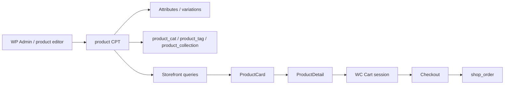

# WooCommerce Architecture

Theme integration lives primarily in:

- `inc/woocommerce.php`
- `inc/woocommerce/ProductPrice.php`
- `inc/components/*` (composers that strip/replace WC hooks)
- `woocommerce/` template overrides

---

## Product flow



1. Products are standard WooCommerce `product` posts.  
2. Variations use WC variation children + attribute taxonomies.  
3. Listings query via `WP_Query` / `woocommerce_product_query`.  
4. PDP uses `global $product` and composers.  
5. Add-to-cart uses WC AJAX (`WC_AJAX` endpoints) and/or form POST.  
6. Orders are WC orders — theme styles account/order templates; processing stays in WC.

---

## Shop page

| Piece | Implementation |
|-------|----------------|
| Template | `woocommerce/archive-product.php` |
| Composer | `ShopArchive` |
| Grid | `ProductGrid` + `ProductCard` |
| Filters | `CatalogFilters` on action `shanelle_shop_archive_filters` |
| Loop config | `loop_shop_per_page` → 24, `loop_shop_columns` → 4 |
| Defaults removed | Standard WC loop title/thumb/price/cart hooks removed globally; archive composer also removes sidebar wrapper hooks |

---

## Category page

- Uses WooCommerce `product_cat` taxonomy archives.  
- Served through the same shop archive composition path as the main shop (filters + grid), subject to the main query.  
- Header category navbar and homepage icons deep-link into category archives.

---

## Product page (PDP)

| Piece | Implementation |
|-------|----------------|
| Template | `woocommerce/single-product.php` |
| Composer | `ProductDetail` |
| Gallery | `ProductGallery` |
| Title/price/stock/excerpt | `ProductSummary` |
| Attributes / swatches | `ProductVariations` |
| Qty / ATC / buy now / favourites / shipping UI | `ProductPurchase` |
| Description accordion | `ProductInformation` |
| Reviews block | `ProductDetail` partial `reviews-section.php` |
| Related | `ProductRelated` |

`ProductDetail::configure_single_product_hooks()` removes WC default summary/tabs/upsells/related hooks and theme wrappers, then the composer renders the custom layout.

Cart form open/close is owned by `ProductDetail` (`variations_form` / simple `cart` form with nonces and hidden fields).

---

## Cart

| Piece | Implementation |
|-------|----------------|
| Templates | `woocommerce/cart/cart.php`, `cart-empty.php`, `shipping-calculator.php` |
| Composer | `CartPage` |
| Line items | `MiniCart::build_cart_state()` reused |
| AJAX refresh | `wc_ajax_shanelle_cart_page_get` (+ mini-cart update endpoint) |
| Coupons / shipping calc | WooCommerce core handlers in themed UI |
| Cross-sells | `ProductGrid` |

Docs: [pages/CART.md](./pages/CART.md).

---

## Checkout

| Piece | Implementation |
|-------|----------------|
| Template | `woocommerce/checkout/form-checkout.php` (+ `form-coupon.php`) |
| Composer | `CheckoutPage` |
| Fields / payment / place order | WooCommerce checkout hooks & processor |
| Order review UI | Custom render on `woocommerce_checkout_order_review` |
| Fragments | `woocommerce_update_order_review_fragments` filter |

**Not implemented yet:** PixelPay, BAC, Stripe, PayPal as configured live gateways in the theme (add as WC payment plugins later).

Docs: [pages/CHECKOUT.md](./pages/CHECKOUT.md).

---

## Account

| Piece | Implementation |
|-------|----------------|
| Composer | `MyAccountPage` |
| Overrides | `woocommerce/myaccount/*` (dashboard, orders, addresses, login, password, downloads, payment methods, view-order, navigation, etc.) |
| Guest auth UI | `my-account-page-guest.php` + login forms |
| Registration | Forced available via filter on `option_woocommerce_enable_myaccount_registration` |

Docs: [pages/MY_ACCOUNT.md](./pages/MY_ACCOUNT.md).

---

## Order flow

Theme does **not** replace order creation:

1. Checkout submit → WC checkout processor  
2. Payment gateway (WC) → order status  
3. Emails → WC email templates (not customized in theme audit)  
4. Customer views order via My Account `view-order` override  

**Not implemented yet:** Custom order status machine for Cargo Mobil tracking UI.

---

## Product attributes

`CatalogFilters` expects these global attribute taxonomies (when registered in WC):

| Taxonomy | Filter UI |
|----------|-----------|
| `product_cat` | Category radio |
| `pa_size` | Checkbox |
| `pa_color` | Color (optional term meta `shanelle_color_hex`) |
| `pa_material` | Checkbox |
| `pa_detail` | Checkbox |
| `pa_style` | Checkbox |
| `pa_type` | Checkbox |
| `pa_length` | Checkbox |
| `pa_feature` | Checkbox |
| Price | Range (query params, not attribute) |

`ProductRelated` scoring can use (filterable defaults): `pa_season`, `pa_occasion`, `pa_color-family`.

If an attribute taxonomy is missing in the store, that filter group simply has no terms — theme does not auto-register attributes.

---

## Variations

- `ProductVariations` builds attribute groups for variable products.  
- Extends `woocommerce_available_variation` with Shanelle stock/price fields (alongside `ProductSummary`).  
- Color swatches resolve term color via filter `shanelle_variation_swatch_color`.  
- Gallery sync messaging exists as “coming soon” / incomplete sync labels in component i18n.  

**Not implemented yet:** Full variation → gallery image sync productization beyond placeholders.

---

## Hooks (theme ↔ WooCommerce)

### Notable removals (examples)

- Shop loop default link/title/thumb/price/ATC hooks (`inc/woocommerce.php`)  
- Single product summary/images/tabs/upsells/related (`ProductDetail`, `ProductRelated`)  
- Checkout login/coupon default placements & order review (`CheckoutPage`)  
- Theme `shanelle_before_main_content` wrappers removed again on specialized pages  

### Notable adds

- `woocommerce_before_shop_loop_item` → `shanelle_product_card_start` (legacy loop path)  
- `woocommerce_add_to_cart_fragments` → cart count + MiniCart fragments  
- `woocommerce_available_variation` → price/stock extensions  
- `woocommerce_product_query` → catalog filters  
- `wc_ajax_shanelle_*` → mini cart / cart page  

Full custom hooks: [CUSTOM_HOOKS.md](./CUSTOM_HOOKS.md).

---

## Filters (theme-owned examples)

- `shanelle_product_price_data`  
- `shanelle_catalog_filter_groups`  
- `shanelle_product_information_*` content filters  
- `shanelle_product_shipping_estimate` / `shanelle_product_delivery_estimate`  
- Cart/checkout/mini-cart state & totals filters  

---

## WooCommerce overrides (inventory)

```
woocommerce/
├── archive-product.php
├── single-product.php
├── taxonomy-product_collection.php
├── cart/
│   ├── cart.php
│   ├── cart-empty.php
│   └── shipping-calculator.php
├── checkout/
│   ├── form-checkout.php
│   └── form-coupon.php
└── myaccount/
    ├── my-account.php
    ├── navigation.php
    ├── dashboard.php
    ├── orders.php
    ├── view-order.php
    ├── downloads.php
    ├── form-edit-account.php
    ├── form-edit-address.php
    ├── my-address.php
    ├── form-login.php
    ├── form-lost-password.php
    ├── form-reset-password.php
    ├── lost-password-confirmation.php
    └── payment-methods.php
```

Also root: `taxonomy-product_collection.php` (theme root) for hierarchy fallback.

---

## Custom taxonomy (catalog module)

| Item | Value |
|------|-------|
| Taxonomy | `product_collection` |
| Object type | `product` |
| Rewrite | `/collection/` hierarchical |
| REST | `show_in_rest` true |
| Term meta | `_collection_type`, `_collection_start`, `_collection_end`, `_collection_hero_id`, `_collection_display_order` |
| Registration | `inc/catalog/Collections.php` |

---

## Related docs

- [DATA_FLOW.md](./DATA_FLOW.md)  
- [ROUTES.md](./ROUTES.md)  
- [DATABASE.md](./DATABASE.md)  
